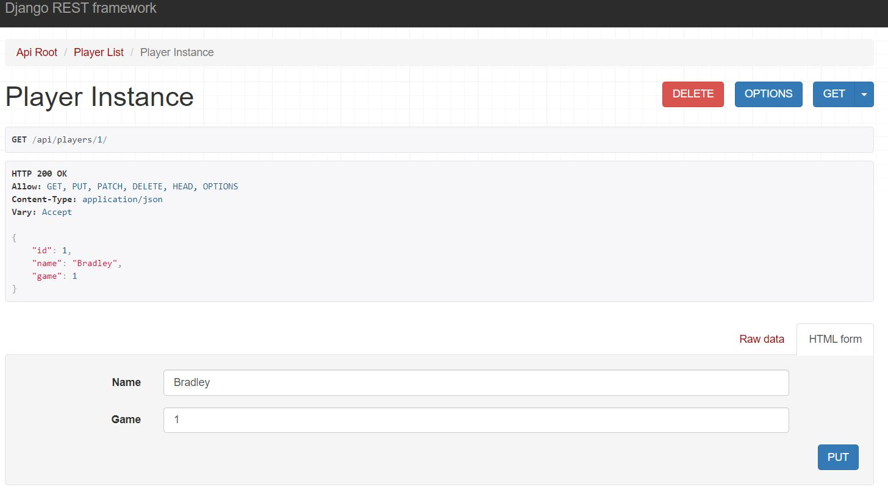

# Bowling Score API

---

## Table of Contents
- Overview
- Set up
- Running the API
- Testing

---

## Overview
This API uses the Django Rest Framework feature to replicate a Bowling scoring application. This project was inspired by the Software Engineering and Hiring teams at Zebra. 

Project Specs:
"The challenge is to implement a bowling scoring REST API (and optional front end). Basically, something that takes in pins knocked down for players and keeps track of them and calculates and provides their scores.
"
Used this as reference: 
http://bowling.about.com/od/rulesofthegame/a/bowlingscoring.htm


- If you were in a bowling alley and looked at the display, it would be the service that powered the numbers behind the display.
- Use production-quality code that's well-tested and well-documented. 
- Show usage of a REST framework
- Any modern language is permissable so I will use Python. 
- The solution should score as the game progresses rather than just at the end.

## Set up
This project requires prior installations of both Python and Django. 

- If you do not have either, you may follow the links below:
Python 3x: https://www.python.org/downloads/
Django:https://docs.djangoproject.com/en/3.2/topics/install/

In your command-line:
- Clone the repository to your desired directory folder and enter the repo
```bash

mkdir <folder-name>
cd <folder-name>

git clone git@github.com:sterlingdhill/bowling-score-api.git

cd bowling-score-api/bowlingscore

```

### Wiping your data and starting fresh
There are some records in the API already within the sqlite file. If you would like to start fresh, simply type in the 
command-line python manage.py flush. You will be prompted if you would like to erase the dataset, input Yes

## Running the API
Enter the project 'bowlingscore' and run the command > python manage.py runserver

```bash
cd bowlingscore

python manage.py runserver
```

- From here we are given the server location: 127.0.0.1:8000/. We want to go straight to the api serializer so input **127.0.0.1:8000/api** into the browser.


From here we will choose the 'players' endpoint so click that link to begin creating a player.

### Creating, Retrieving, Updating and Deleting Players


You can enter the players name and which game number they are to be apart of, both of these fields are required so the database and API can identify which players go with which game. 

Note: You **CANNOT** have a duplicate name for the same game. 

If you would like to update or delete characters you will need to input their id number in the url endpoint. For example:
**127.0.0.1:8000/api/players/1**



Once satisfied with the player record created, navigate back to the directory and click the endpoint for bowling. You can either type **in 127.0.0.1:8000/api/bowling** in the browser or click on the read url links in the top left to navigate to the API Root and choose 'bowling' that way.

### Calculating the Scores in a game

We can now start simulating scores on this screen. Make sure to fill these fields:
- frame num: The frame number for the round. Note: You cannot have duplicate frames per player 
- player: The players will appear as objects with their respective id number, select the player
- first roll: pins knocked down in the first roll
- second roll:pins knocked down in the second roll
- tenth frame bonus pins*optional field*: total pins knocked down after the tenth frame. Note: This field is only used if the player gets a strike or spare in their last/tenth frame.


This is the output after POSTing


The previous variables entered in json format with a few new variables:
- strike_spare: calculates if the resulting frame was a strike, spare, or neither of the above. Note: if the first roll is a 10 its automatically a strike, if not and both the rolls result in 10 or higher its a spare.
- frame_score: This is the score of the frame. If the frame is a strike or spare, this value can change as a result of later frames.
- total_score: This is the total score tallied thus far. This value will also change as a result of later frames scores if those frames are strikes and spares. *Note: It is possible to skip frames, so the total score will use the most previous total score, if no previous score then it will return the frame score of that frame*


A few notes:

1. Because the API is dynamically calculating changes, any deletion and update of prior frames will affect the total scoring of the frames before them. It won't break the API, but the score will be lower than anticipated.
2. You are required to enter the number and rolls of each frame, and each field has an acceptable range. 
3. Frame scores get recalculated with every request and the API won't wait to add succeeding frames for strikes and spares.


## Testing
I did mock up a few unit tests for the Creation, Retrival, Updating, and Deletion of Scores and Players but due to the newness of testing with Django Rest API and running out of time, I did not finish so most of the tests are still broken and unfinished. 
The tests were mocked up using Django's standard TestCase and rest_framework's APITestCase classes. Admittedly, I spent too much of the time with the documentation and ended up having to perform manual testing. In Production, its always good to operating under TDD (Test-Driven Development) and create your unit tests. By running unit tests you know whether or not a change to any piece of code has affected features of the product you didn't expect.

I manually tested (testing checklist):
- Users are able to Create, Retrieve, Update, and Delete every record
- Strikes, spares, and neithers are calculated based on the rolls of the frame
- Player and frames are unique, no duplicates records are allowed 
- Each player can only input the first 10 frames
- The bonus pins can only be added to the total score, given we are in the 10th frame and we 
- There can be no duplicate frame entries and the user must delete or update the duplicate
- Frame scores for strike or spare frames are being updated as we complete more frames.
    - If strike or spare, then the frame will be updated to add the succeeding frame pins
    - If strike, the nthe frame will be updated to add the pins of succeeding frame and the frame after that. 
- Total score is continuously being updated the more frames completed and frame scores calculated.
- Frames are skippable, and the total score will be calculated from the frames that have been 

If you want to view any of the drafted unit tests they can be found in **bowlingscore/bowlingscore/test/test.py**

They are runnable by using the command-line 
```bash
cd bowling-score-api/bowlingscore

...

python manage.py test
```
